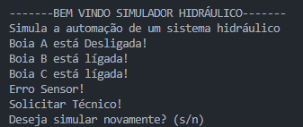

# Simulador Hidráulico

## Descrição

Este projeto é um simulador de um sistema hidráulico, que utiliza uma lógica simples para representar o funcionamento de boias e registros. O simulador gera aleatoriamente o estado de três boias (A, B e C) e, com base nesses estados, exibe mensagens indicando ações a serem tomadas no sistema, como ligar registros ou solicitar técnicos.

## Funcionalidades

- Simulação aleatória do estado de três boias:
  - Boia A
  - Boia B
  - Boia C
- Exibição do estado de cada boia (ligada ou desligada).
- Ações baseadas no estado das boias, incluindo:
  - Ligar registros
  - Ligar bombas
  - Notificar erro em sensores
- Opção para reiniciar a simulação.

## Tecnologias Utilizadas

- C#
- .NET

## Como Usar

1. Clone o repositório ou baixe os arquivos.
2. Abra o projeto no Visual Studio ou em outro IDE de sua escolha que suporte C#.
3. Compile e execute o programa.
4. Siga as instruções exibidas no console para interagir com o simulador.

## Demonstração
Demonstração algoritmo em uso.

## Contribuições

Contribuições são bem-vindas! Se você deseja sugerir melhorias ou corrigir erros, sinta-se à vontade para abrir uma issue ou criar um pull request.

